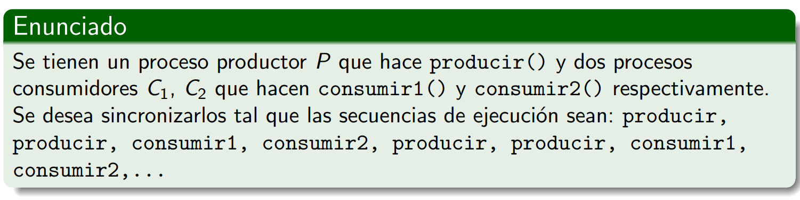
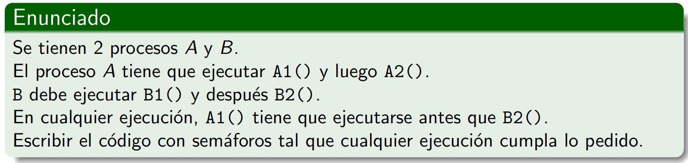
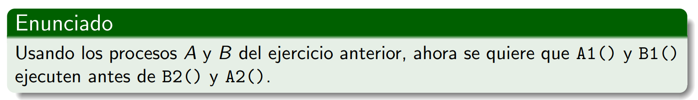
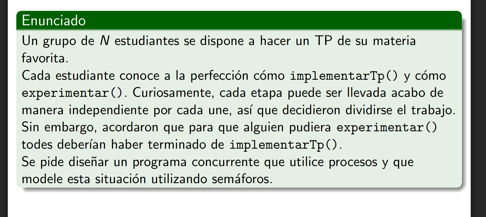

### Ejercicio 1

**Solución:**
    
    semaforo_t permiso_c1 = sem(0)  //Queremos que C1 empiece recien cuando P() le de el okay
    semaforo_t permiso_c2 = sem(0)  //Queremos que C2 empiece recien cuando C1() le de el okay
    semaforo_t permiso_P = sem(1)   //Queremos que P arranque de una

    void P(){
        while(1){
            permiso_p.wait()        
            producir()
            producir()
            permiso_c1.signal()
        }
    }

    void C1(){
        while(1){
            permiso_c1.wait()
            consumir1()
            permiso_c2.signal()
        }    
    }

    void C2(){
        while(1){
            permiso_c2.wait()
            consumir2()
            permiso_P.signal()
        }
    }

### Ejercicio 2

**Solución:**

    //no usar atomico para consulta + asignacion pq se podria hacer en pasos separados
    permiso_B2 = sem(0)

    void A(){
        A1()
        permiso_B2.signal()
        A2()
    }

    void B(){
        B1()
        permiso_B2.wait()
        B2()
    }

### Ejercicio 3

**Solución: Sin Deadlock** 

    permisoB = sem(0)
    permisoA= sem(0)

    void A(){
        A1()
        permisoB.signal()
        permisoA.wait()
        A2()
    }

    void B(){
        B1()
        permisoA.signal()
        permisoB.wait()
        B2()
    }

**CUIDADO, Deadlock** 

    permisoB = sem(0)
    permisoA = sem(0)

    void A(){
        A1()
        permisoA.wait()
        permisoB.signal()
        A2()
    }

    void B(){
        B1()
        permisoB.wait()
        permisoA.signal()
        B2()
    }

### Ejercicio 4, locura

**Solución:**

    listo = sem(1)
    experimento = sem(0)
    n = N

    void estudiante(){

        implementarTp();

        listo.wait()
        n--
        if n==0{
            expermiento.signal()
        }
        listo.signal()

        experimento.wait()
        experimento.signal()
        experimentar()
    }